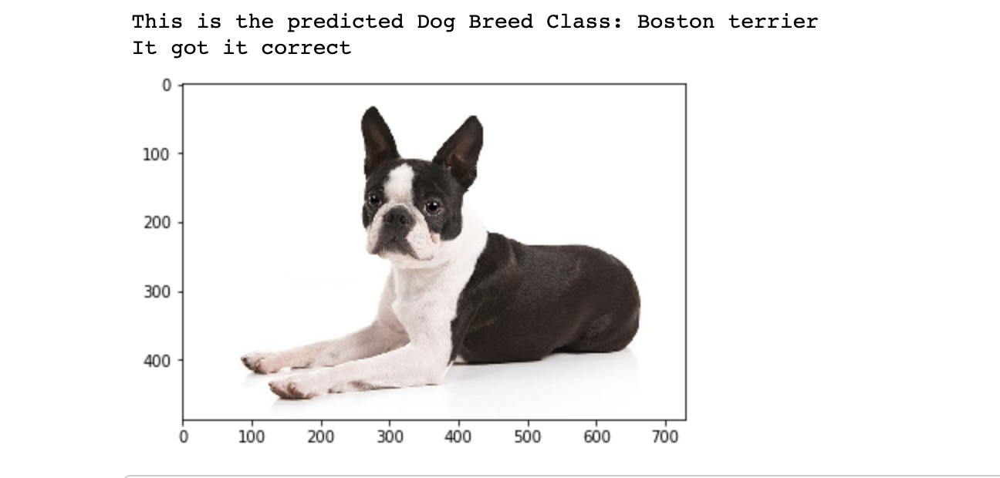

# DogBreedClassiferProject
The _Dog Breed Classifier Project_ utilizes Convolutional Neural Networks (CNN) to classify between Dog Breeds and also classify a dog breed look alike for any human.
The project uses two methods for classification:
- **Creation of CNN from Scratch**
- **Using Transfer Learning for Classification**

 ### This a sample output:

## Dependencies 
Make sure you have conda installed. You can learn how to do this by clicking the: 
- [Anaconda Installing Guide](https://docs.anaconda.com/anaconda/install/)

The project is a notebook file that requires the use of several libraries. Most of them come in default when creating a new conda environment. 

`% conda create -n [conda env name] python=3`

Some of the primary packages used in the project are:

* Numpy
* torchvision
* torch 
* PIL
* cv2
* glob
* matplotlib
* os

**If any of these libraries are not in your conda environment then you can install them using the following line of code in the terminal**

`% conda install [missing package]`

For more information about Anaconda, environments, or installation visit the [documentation](https://docs.anaconda.com/). 

## Getting Started
### Datasets

Make sure that you've downloaded the required human and dog datasets:
Get access to the dog datasets using the repo found here in [Download Data in this repo](https://github.com/udacity/deep-learning-v2-pytorch/tree/master/project-dog-classification)

Download the dog dataset. Unzip the folder and place it in this project's home directory, at the location /dog_images.

Download the human dataset. Unzip the folder and place it in the home directory, at location /lfw.

Note: If you are using a Windows machine, you are encouraged to use 7zip to extract the folder.

In the code cell below, we save the file paths for both the human (LFW) dataset and dog dataset in the numpy arrays human_files and dog_files.

## Clone finished repository
Go to the directory where you want to clone the project and also the right environment that you created:

Put the following code:
`% git init`

Then clone the repo:
`git clone https://github.com/SarthakJaingit/DogBreedClassiferProject.git`

When you are finished you can deactivate your conda environment. 

